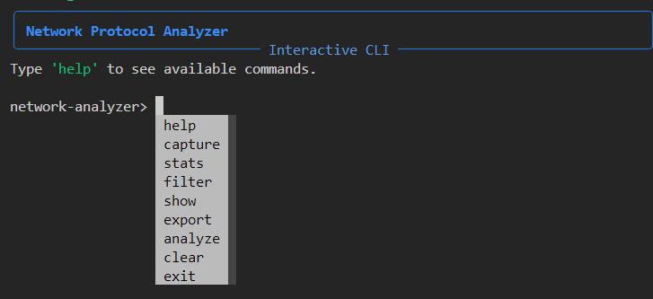

# 🔍 PinDoster - Network Protocol Analyzer

[](https://www.python.org/downloads/)
[](https://github.com/Nekicj/PinDoster)

> A lightweight, powerful network protocol analyzer and packet sniffer for real-time traffic inspection, protocol analysis, and network monitoring.

## 📋 Table of Contents

- [Overview](#-overview)
- [Features](#-features)
- [Requirements](#-requirements)
- [Installation](#-installation)
- [Usage](#-usage)
  - [Interactive Mode](#interactive-mode)
  - [Capture Mode](#capture-mode)
- [Contributing](#-contributing)
- [License](#-license)
- [Disclaimer](#-disclaimer)

## 🌐 Overview

PinDoster is a comprehensive network analysis tool designed for security professionals, network administrators, and educational purposes. It provides deep insight into network traffic with advanced protocol analysis and real-time monitoring capabilities.

## ✨ Features

- 📊 Real-time packet capture and protocol analysis
- 🔄 Support for multiple protocols (TCP, UDP, ICMP, HTTP, DNS, SMTP)
- 🔬 Deep packet inspection with protocol-specific analysis
- 🧩 Advanced protocol fingerprinting for ambiguous traffic
- 🚨 Traffic pattern detection and anomaly alerts
- 📈 Interactive dashboard with live visualization
- 📶 Connection tracking and bandwidth monitoring

## 📦 Requirements

- Python 3.9+
- Dependencies:
  - scapy >= 2.6.1
  - rich >= 14.0.0
  - prompt_toolkit
- Administrator/root privileges (required for raw packet capture)
- Compatible with Windows, macOS, and Linux operating systems

## 🔧 Installation

1. **Clone the repository:**

```bash
git clone https://github.com/Nekicj/PinDoster.git
cd PinDoster
```

2. **Create and activate a virtual environment:**

```bash
# Create virtual environment
python -m venv venv

# Activate virtual environment
# On Windows:
venv\Scripts\activate
# On macOS/Linux:
source venv/bin/activate
```

3. **Install the required dependencies:**

```bash
# Install main dependencies
pip install rich scapy prompt_toolkit

# Or if a requirements file exists
pip install -r requirements.txt
```

## 🚀 Usage

PinDoster offers two primary modes of operation:

### Interactive Mode

The interactive mode provides a command-line interface for exploring network traffic with rich, interactive controls:

```bash
# Launch interactive mode
python -m src.main interactive
```

### Capture Mode

Capture mode allows you to capture and analyze packets directly:

```bash
# Start packet capture
python -m src.main capture
```

For both modes, you may need to run the command with administrator/root privileges to capture packets properly:

```bash
# On Windows (Run PowerShell or CMD as Administrator)
python -m src.main capture

# On macOS/Linux
sudo python -m src.main capture
```

## 👥 Contributing

Contributions are welcome! If you'd like to help improve PinDoster:

1. Fork the repository
2. Create a feature branch (`git checkout -b feature/amazing-feature`)
3. Commit your changes (`git commit -m 'Add some amazing feature'`)
4. Push to the branch (`git push origin feature/amazing-feature`)
5. Open a Pull Request

## 📄 License

This project is licensed under the MIT License - see the LICENSE file for details.

## ⚠️ Disclaimer

This tool is intended for network administration, educational purposes, and authorized network analysis only. Always ensure you have proper authorization before analyzing network traffic. Unauthorized use for network monitoring or packet sniffing may violate local laws and regulations.
